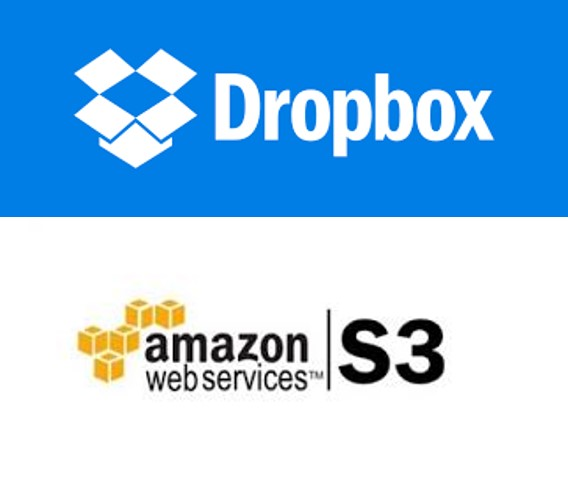
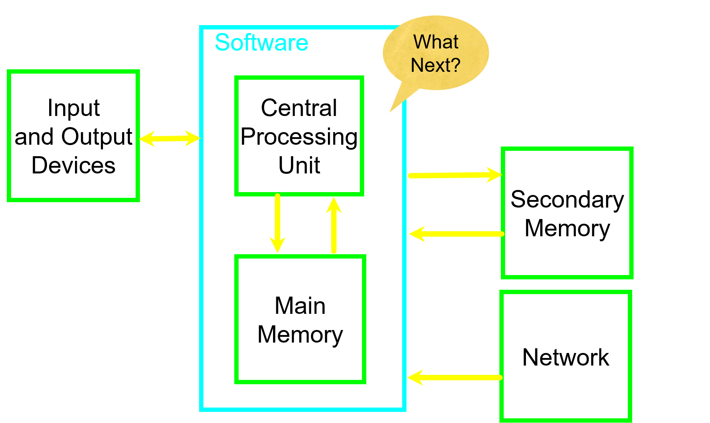
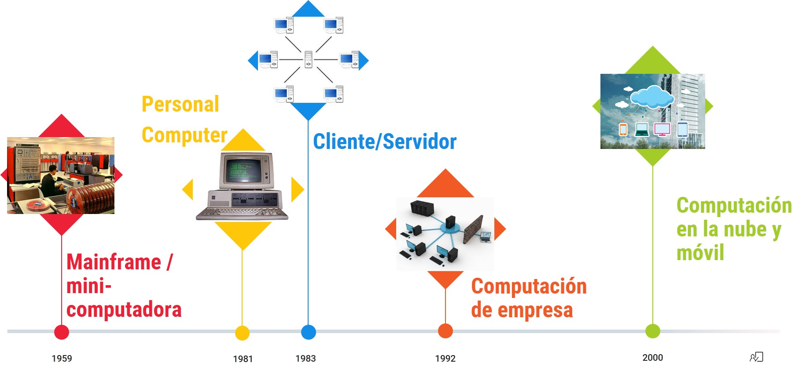
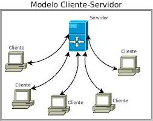
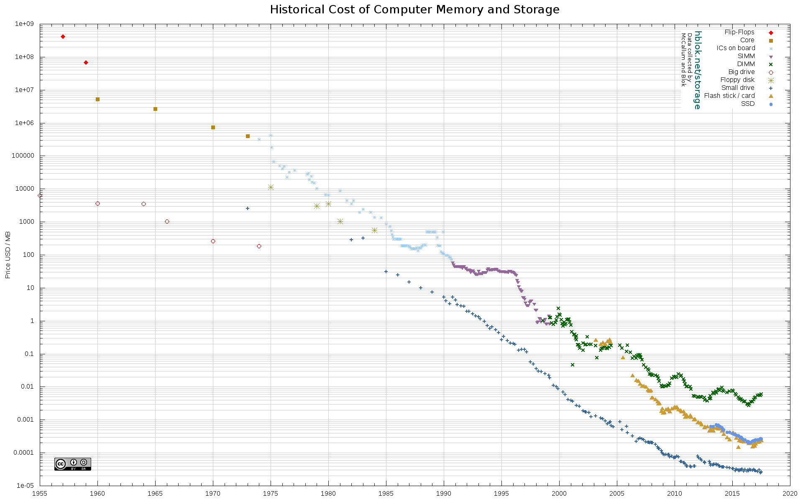
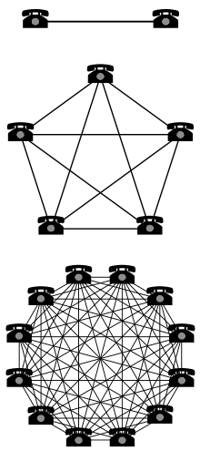

class: center, middle, remark-inverse

# 2. ¿Qué es la infraestructura en Sistemas de Información?

---
class: middle, center

# Infraestructura en SI

> Conjunto de dispositivos físicos así como el software necesario para el funcionamiento de los sistemas de información de la empresa

---
# Perspectiva de servicios

### - Servicios de IT que presta la infraestructura a:

- clientes
- empleados
- proveedores, etc… 

### - Qué funciones debe desarrollar la infraestructura, no tanto qué tecnologías concretas. 

### - Los servicios los prestan también **personas**, no únicamente la infraestructura física.

---

# Componentes en infraestructura

1. ### Plataformas de computación conectadas
1. ### Servicios de telecomunicaciones
1. ### Servicios de gestión de datos 
1. ### Aplicaciones de software
1. ### Servicio de atención de IT 
1. ### Servicios de formación en IT 
1. ### Servicios de investigación y desarrollo en IT 

---
# Análisis de inversiones


.left-column[

```{r echo=FALSE, message=FALSE, warning=FALSE, out.width="80%"}


```
]

.right-column[
### - Perspectiva de servicios: Análisis **valor que añaden al negocio** inversiones en infraestructura.

### - Valor que puede ofrecer la empresa a los clientes (y también a los empleados y proveedores) función de las **capacidades en infraestructura IT**

### - Ejemplo **Dropbox**: Flexibilidad y control  vs Inversión.

]

---
# Componentes básicos en dispositivos TI

.pull-left[
- Hardware: físico
  - Dispositivos entrada y salida
  - Unidad Central de Proceso
  - Memoria Principal
  - Memoria Secundaria
  - Servicios de red
- Software: lógico
  - Sistema operativo
  - Aplicaciones

]

.pull-right[

```{r echo=FALSE, message=FALSE, warning=FALSE, out.width="100%"}


```

]

---

## Etapas evolución de la tecnología de información

```{r echo=FALSE, message=FALSE, warning=FALSE, out.width="100%"}


```

---

# 1. Era mainframes y minicomputadoras

.pull-left[

- desde 1959
- Computación centralizada, distribuidor provee hardware y software, IBM domina el mercado

]

.pull-right[

<iframe width="400" height="300" src="https://www.youtube.com/embed/4DtXo8vQiH8" frameborder="0" allowfullscreen></iframe>
[Fuente del video: EuropaPress](https://www.youtube.com/watch?v=4DtXo8vQiH8)

]

---

# 2. Era ordenador personal

.pull-left[

- desde 1981
- IBM 5150, el primero que se hace popular: llega el concepto de ordenador "propio"

]

.pull-right[

<iframe width="400" height="300" src="https://www.youtube.com/embed/hHt74VMtEME" frameborder="0"></iframe>
[Fuente del video: Explora Conucyt](https://www.youtube.com/watch?v=hHt74VMtEME)

]

---
# 3. Era cliente-servidor

.pull-left[

- desde 1983
- Ordenadores de sobremesa conectados en redes a los servidores
- Combina el poder de las mainframes con el de los nuevos PCs</li>
- Las redes pueden ser de 2 niveles o de varios niveles (N niveles) y puede haber varios servidores (redes, aplicaciones Web)
]

.pull-right[

```{r echo=FALSE, message=FALSE, warning=FALSE, out.width="100%"}


```

]
                      
---
# 4. Era de las Redes de Empresa

.pull-left[

- desde 1992
- Existen redes y aplicaciones dispares en las empresas
- Estándares de integración y creación de infraestructura empresarial: Estándar TCP/IP
- Se enlazan mainframes, servidores, PCs, teléfonos móviles, PDAs y otros dispositivos</li>
]


.pull-right[

```{r echo=FALSE, message=FALSE, warning=FALSE, out.width="100%"}

knitr::include_graphics("images/network.png")
```

]

---
# 5. Era Cloud y computación móvil

.pull-left[

- desde 2000
- Reserva compartida de recursos computacionales: poder de cómputo, almacenamiento, aplicaciones, servicios...
- Crecimiento rápido de la capacidad de computación

]

.pull-right[
<iframe width="460" height="315" src="https://www.youtube.com/embed/cHFVVdEzcrQ" frameborder="0" allowfullscreen></iframe>
[Fuente del video: Amazon](https://www.youtube.com/watch?v=cHFVVdEzcrQ)

]

---
class: center

# Determinantes de la evolución

## - Capacidad de procesadores: Ley de Moore

```{r echo=FALSE, message=FALSE, warning=FALSE, out.width="60%"}

knitr::include_graphics("images/moore.png")
```

---
class: center

# Determinantes de la evolución

## - Costes del almacenamiento de información

```{r echo=FALSE, message=FALSE, warning=FALSE, out.width="60%"}


```

[Fuente: hblok.net](https://hblok.net/blog/storage/)
---

# Determinantes de la evolución

.pull-left[

## - Valor de las redes: Ley de Metcalfe

> Valor de una red de telecomunicación aumenta proporcionalmente al cuadrado del número de usuarios del sistema.

]

.pull-right[

```{r echo=FALSE, message=FALSE, warning=FALSE, out.width="40%"}


```

]

---

# Determinantes de la evolución

##  Estándares comunes tanto en componentes como en software 

[https://www.w3.org/](https://www.w3.org/)
                  