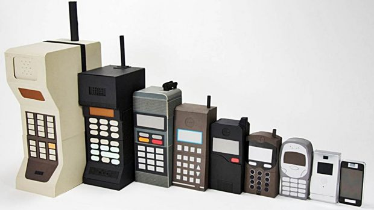
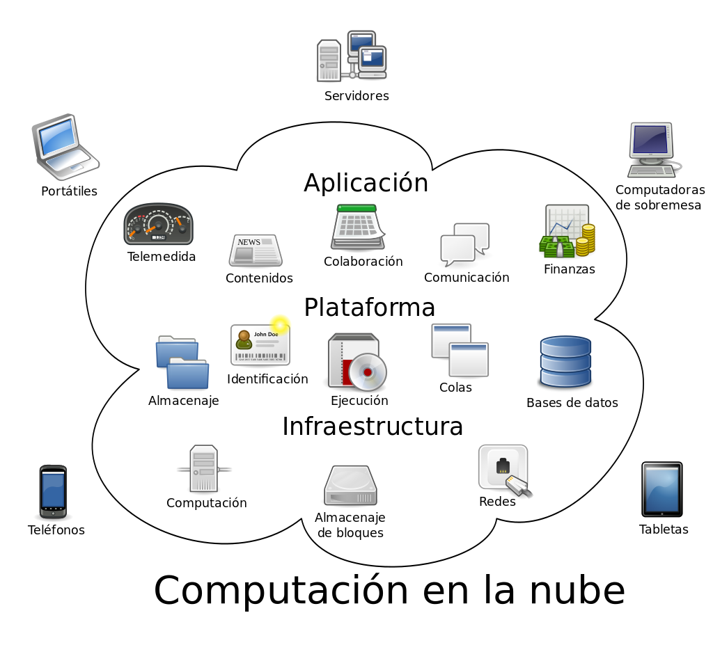

class: center, middle, remark-inverse

# 4. Tendencias de Plataformas de Hardware y Software

---

# 1. Teletrabajo y teledocencia

## Desde el año 2020, la forma de trabajar se ha transformado:

- Diez años de avances tecnológicos en dos meses https://www.uppers.es/economia-y-dinero/vida-laboral/coronavirus-maquina-tiempo-avances-tecnologicos-teletrabajo_18_2942895153.html

- Trabajo híbrido: ¿lo peor de dos mundos?: relaciones, oportunidades de promoción: https://www.wired.com/story/hybrid-remote-work-offers-the-worst-of-both-worlds/

---


# 2. Plataformas móviles

### - Móviles como alternativa viable a los ordenadores

### - Principal dispositivo de acceso a Internet en muchos países: en España, el acceso móvil ya supera al fijo, y en Asia es el dispositivo principal.

.center[

```{r echo=FALSE, message=FALSE, warning=FALSE, out.width="40%"}


```
]
---

# 3. Consumerización de la IT

### - "Bring your own device"

- Dispositivos personales
- Servicios online (Gmail, Dropbox, Twitter…)

### - Ventajas: ahorro de costes
### - Retos: seguridad, homogeneidad


---
# 4. Computación en la nube

.pull-left[
### - Utilizar de forma coordinada recursos heterogéneos y físicamente distantes, basándose en Internet y centralizada en un proveedor. 

### - IaaS: Infraestructure as a Service
### - PaaS: Platform as a Service
### - SaaS: Software as a Service

]

.pull-right[

```{r echo=FALSE, message=FALSE, warning=FALSE, out.width="100%"}


```
]

---

# Ventajas e inconvenientes del "cloud"

.pull-left[
### - Escalabilidad
### - Baja inversión y mantenimiento
### - Fácil uso
]

.pull-right[
### - Dependencia proveedor
### - Privacidad y seguridad
### - Dependencia Internet

]
---
class: center, middle

# 5. Otras tendencias

### Nanotecnología, computación cuántica, computación “green”, inteligencia artificial 

---
class: middle

<a href="https://b.socrative.com/teacher/" target="_blank">
  <button class="btn btn-final">
    <span class="buttoninner"><i class="fas fa-question-circle"></i> Test en Socrative</a> </span>
  </button>
</a>


# Secciones

### 3.1 Introducción
### 3.2 Qué es la infraestructura de tecnología de información
### 3.3 Componentes en la decisión de infraestructura
### 3.4 Tendencias en infraestructura de hardware

https://www.mindomo.com/mindmap/900a5b8534a243a2a6867bac5ca9881e


